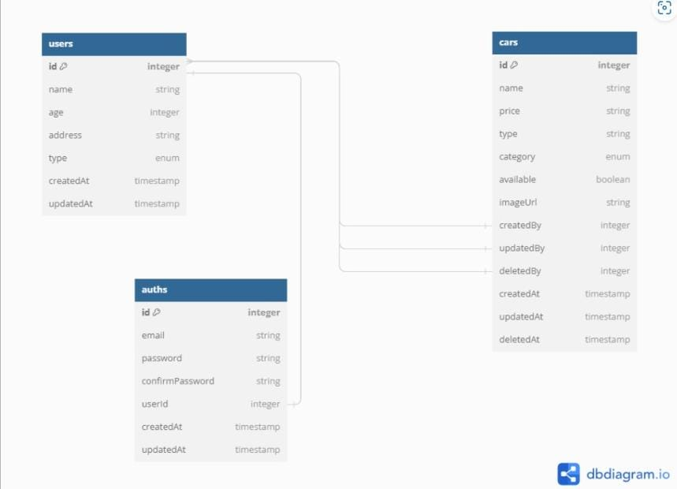

# Challenge Chapter 5

## Installations

Before you start, make sure you have downloaded NPM (Node Package Manager), NodeJS at least version 16, register website cloudinary and download postgreqsl

#### Clone Repository

```shell
git clone https://github.com/syifasukmaa/CH5-cars-management.git
cd CH5-cars-management
```

#### Install Depedencies

```shell
npm install
```

#### Set up Environment

```shell
DB_USERNAME= your_username_database
DB_PASSWORD= your_password_database
DB_NAME= your_type_database
PORT= your_port
JWT_SECRET = your_jwt_password

CLOUD_NAME = your_name_cloudinary
CLOUD_API_KEY = your_api_key_cloudinary
CLOUD_API_SECRET = your_api_secret_cloudinary
```

## Usage

### initialization sequelize

```shell
npx sequelize init
```

### Create database

```shell
npx sequelize db:create
```

### Run the migrations

```shell
npx sequelize db:migrate
```

### Seed database with initial data

```shell
npx sequelize db:seed:all
```

### Start Development Server

```shell
npm run dev
http://localhost:3000/dashboard
```

## Access API Document

```shell
http://localhost:your_port/api-docs
```

## ERD


